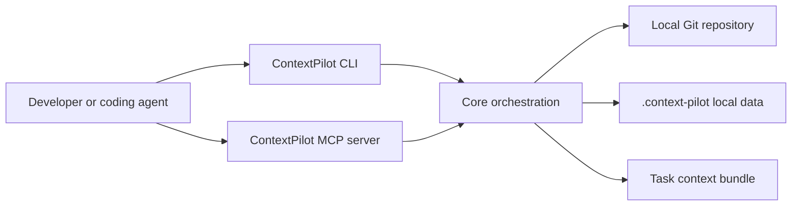
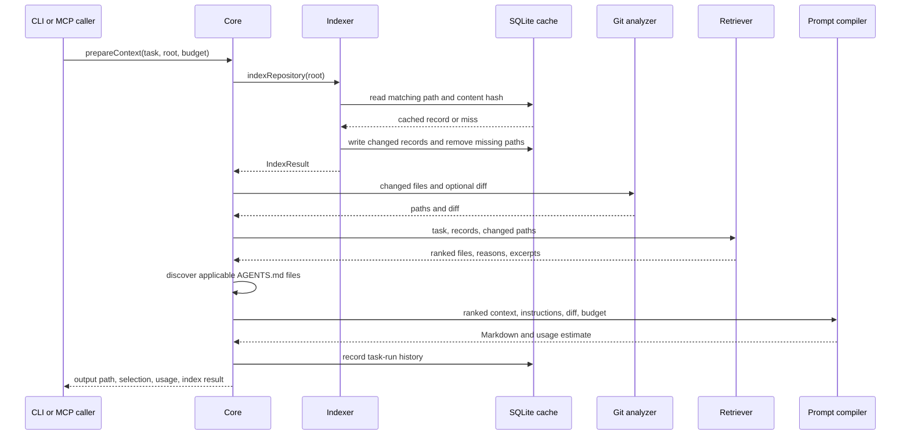

# ContextPilot architecture

## Purpose and scope

ContextPilot reduces the amount of repository material a coding agent needs to
inspect before working on a task. It creates a local repository index, retrieves
relevant files and symbols with explainable rules, and compiles a bounded
Markdown context bundle.

The architecture is designed around five quality attributes:

1. **Privacy:** repository content stays on the local machine by default.
2. **Explainability:** every retrieval decision has human-readable reasons.
3. **Determinism:** the default indexing and ranking path does not require a
   remote model or embedding service.
4. **Bounded context:** compilation respects a caller-provided estimated-token
   budget and reports omissions.
5. **Interface consistency:** CLI, library, and MCP clients use the same core
   orchestration.

Token values are estimates. ContextPilot cannot observe or control a coding
agent's hidden context, prompt cache, output tokens, billing, or exact tokenizer.

## System context



### In scope

- reading indexable repository files;
- deterministic file summaries, symbols, and import extraction;
- cached local metadata;
- lexical task-aware retrieval;
- Git change and diff signals;
- hierarchical `AGENTS.md` discovery;
- estimated-token budgeting and Markdown compilation;
- local task history and estimated reduction reports;
- CLI and local stdio MCP interfaces.

### Out of scope

- changing Codex's internal context or billing;
- uploading source code;
- executing generated code or repository tasks during retrieval;
- remote embeddings or hosted vector storage;
- authoritative language-semantic analysis;
- guaranteeing that every runtime dependency is discovered;
- acting as an access-control or secret-scanning boundary.

Future networked or model-backed features must be explicit opt-ins and must
document data sent, destination, retention, authentication, and a local-only
fallback.

## Runtime containers

| Container | Location | Responsibility |
| --- | --- | --- |
| CLI | `apps/cli` | Parses commands, formats results, starts MCP mode, and manages Codex MCP registration. |
| Core | `packages/core` | Coordinates indexing, Git analysis, retrieval, instruction discovery, compilation, persistence, and output. |
| Indexer | `packages/indexer` | Walks files and creates deterministic `FileRecord` values. |
| Cache | `packages/cache` | Stores file records and task-run history in SQLite. |
| Retriever | `packages/retriever` | Scores candidate files and extracts focused source excerpts. |
| Prompt compiler | `packages/prompt-compiler` | Allocates the budget and renders the Markdown bundle. |
| Git analyzer | `packages/git-analyzer` | Reads changed paths, diffs, and the current commit through Git. |
| Token estimator | `packages/token-estimator` | Estimates token counts and truncates text to estimated budgets. |
| MCP server | `servers/mcp-server` | Exposes core operations as validated local stdio MCP tools. |

Dependencies point toward `core` types and pure domain operations. Interfaces
delegate to the core rather than reimplementing retrieval behavior.

## End-to-end data flow



### 1. Repository indexing

The indexer recursively walks the repository. It excludes internal metadata and
common generated or dependency directories, including `.git`,
`.context-pilot`, `dist`, `node_modules`, `coverage`, `vendor`, and language
build directories. Files larger than the configured one-megabyte limit and
binary-looking content are skipped.

For each supported file, the indexer derives:

- normalized repository-relative path;
- language and line count;
- imports;
- named symbols and approximate line boundaries;
- deterministic summary;
- content-derived cache hash;
- indexing timestamp.

The current extractor intentionally uses deterministic parsing heuristics.
Those heuristics are fast and dependency-light, but they are not a replacement
for Tree-sitter or a language server. Precision improvements should preserve
the existing local-first fallback.

### 2. Cache reuse

`SummaryCache` creates `.context-pilot/cache.db` and enables SQLite
write-ahead logging. The database contains:

- `file_summaries`, keyed by path and validated by hash;
- `task_runs`, an append-only history of generated bundles and estimates.

Unchanged paths reuse their serialized `FileRecord`. Changed files replace the
existing row. Missing paths are removed transactionally after a successful
walk.

The cache is disposable derived data. Users can delete `.context-pilot/` to
force a complete rebuild.

### 3. Git analysis

Git provides high-value change signals without becoming a hard requirement.
When available, changed files receive the strongest retrieval boost, and
dependencies or dependents of changed files receive smaller boosts. Diff mode
also gives the compiler a bounded copy of the current patch.

If the target is not a Git repository or Git information is unavailable, the
pipeline continues with repository and task signals.

### 4. Explainable retrieval

The task is normalized into useful terms with stop-word removal and lightweight
stemming. Candidate scores are accumulated from:

| Signal | Intent |
| --- | --- |
| Filename/path match | Prefer modules whose ownership is visible in their location. |
| Symbol match | Prefer declarations directly named by the task. |
| Summary match | Include files whose purpose aligns with the task. |
| Git change | Center current development work. |
| Import relationship | Include immediate dependencies and dependents. |
| Related test | Preserve validation context near the selected behavior. |

Every positive signal adds a readable reason. Stable score ordering and path
tie-breaking make the same repository state and task reproducible.

For a selected file, excerpt selection follows this order:

1. up to three matching symbol regions;
2. a bounded window around the first matching line;
3. the entire file when it is small;
4. summary only when no useful excerpt fits.

### 5. Repository instructions

The core always considers the root `AGENTS.md`. For each selected path, it also
walks ancestor directories and includes applicable nested `AGENTS.md` files.
This preserves repository-specific rules without placing all instructions in a
single permanent prompt.

Instruction content receives a bounded portion of the total budget.

### 6. Prompt compilation

The compiler builds the bundle in priority order:

1. task and agent guidance;
2. applicable repository instructions;
3. changed-file inventory;
4. bounded Git diff;
5. ranked file summaries and excerpts;
6. usage report.

The compiler reserves space for the usage report and falls back from excerpt to
summary when a complete section does not fit. Lower-priority files are omitted
with an explicit notice.

The current budget is approximate because token estimation uses character and
syntax-density heuristics. Small overages can occur when the final usage report
is added. Callers must treat the budget as a planning target, not a strict model
API limit.

## Public interfaces

### Library

The package root exports the core API and types. `prepareContext` is the primary
entry point. `repositoryStats` and `taskHistory` expose local operational data.
Interfaces should remain asynchronous even where current implementations use
synchronous SQLite operations, allowing internals to evolve without breaking
callers.

### CLI

The CLI supports human-readable output and machine-readable `--json` output.
Commands should:

- return a nonzero exit code for invalid input or failed operations;
- write diagnostics to standard error;
- keep successful structured output stable enough for automation;
- avoid logging to standard output while running MCP mode.

### MCP

The MCP server communicates over stdio and validates arguments with Zod. It
exposes `prepare_context`, `index_repository`, `diff_context`, `context_stats`,
and `context_history`. Tool responses are JSON serialized inside MCP text
content.

MCP handlers should remain thin adapters. New behavior belongs in a package
that can also be exercised from the CLI and tests.

## Privacy and security model

### Trust boundaries

Repository files, Git output, and `AGENTS.md` content are untrusted input.
ContextPilot reads and summarizes them; it must not execute content discovered
while indexing. The only subprocess boundary in the core pipeline is the Git
executable with an explicit argument array.

The stdio MCP caller is trusted to choose the repository root. ContextPilot does
not provide sandboxing or authorization between repositories available to the
current operating-system user.

### Data handling

- Source and derived metadata remain local.
- Generated data is written only under the target repository's
  `.context-pilot/` directory.
- No telemetry or network transport exists in the default path.
- Task text and selected paths are stored in local task history.
- Generated task bundles can contain source excerpts and must be treated with
  the same confidentiality as the repository.

### Sensitive content

ContextPilot is not a secret detector. If an indexable file contains credentials
or confidential material, its summary or excerpt may appear in a local bundle.
Repositories should exclude secrets from source control and use established
secret-scanning controls.

Security reporting instructions are maintained in
[`SECURITY.md`](../SECURITY.md).

## Reliability and failure behavior

| Condition | Expected behavior |
| --- | --- |
| File disappears during retrieval | Keep the indexed summary and continue without an excerpt. |
| Git is unavailable | Continue without Git-derived ranking or diff context. |
| No file receives a positive score | Select a small repository-overview fallback such as README, AGENTS, and manifest files. |
| Cache is deleted or incompatible | Rebuild disposable local metadata. |
| Budget cannot fit every candidate | Include higher-ranked items and report omissions. |
| Invalid CLI or MCP input | Reject the request with an actionable error. |
| MCP standard output contamination | Treat as a protocol defect; diagnostics belong on standard error. |

Indexing should avoid leaving a partially reconciled cache. Multi-row deletion
uses a transaction. Future schema changes should include explicit migrations
or a documented cache-rebuild strategy.

## Performance characteristics

The default design optimizes for startup simplicity and repositories that fit
comfortably on a developer workstation:

- file traversal is linear in the number of candidate files;
- cache hits avoid repeated summary and symbol work;
- retrieval currently scores every indexed file;
- selected file contents are read again for excerpts and compilation;
- SQLite is local and synchronous;
- no background daemon or watcher is required.

Before changing ranking or caching for performance, add a representative
benchmark and record the repository size, cache state, task, selected-file
quality, wall time, and estimated bundle size. Retrieval quality must not be
traded for speed without evidence.

## Extension points

### Add a language

1. Add extension-to-language mapping in the indexer.
2. Add deterministic symbol and import patterns.
3. Add fixtures for declarations, imports, multiline constructs, and malformed
   files.
4. Verify summaries and stable cache behavior.
5. Document known precision limitations.

### Add a retrieval signal

1. Keep the signal local and explainable.
2. Give it a human-readable reason.
3. Define its weight relative to existing signals.
4. Add positive, negative, and tie-ordering tests.
5. Evaluate representative tasks for relevance regressions.

### Add an MCP tool

1. Implement reusable behavior outside the MCP adapter.
2. define and validate the input schema;
3. return compact, automation-friendly data;
4. add library-level tests and an MCP smoke test where practical;
5. update README, project guide, and this document.

### Add optional semantic retrieval

Any embeddings implementation must be opt-in, local by default, and isolated
behind a retrieval interface. It must disclose model and storage choices,
support deletion, preserve explainable evidence, and retain the deterministic
fallback.

## Testing strategy

The current suite uses Node's test runner with TypeScript loaded by `tsx`.
Architectural changes should be tested at the lowest useful boundary:

- unit tests for term normalization, symbol extraction, token estimation, and
  scoring;
- integration tests for indexing, cache reuse, instructions, bundle creation,
  and history;
- CLI smoke tests for argument handling and output;
- package rehearsal for compiled entry points and global-install behavior;
- regression fixtures for bugs affecting ranking or privacy boundaries.

Tests should use temporary repositories and avoid network access. Assertions on
ranking should verify both selected paths and reasons.

Required validation for TypeScript changes:

```bash
pnpm check
pnpm build
```

Before release:

```bash
pnpm release:check
pnpm release:rehearse
```

## Architecture governance

Changes that alter public APIs, package boundaries, persistence format, privacy
behavior, retrieval semantics, or default dependencies require an Architecture
Decision Record (ADR). Use
[`docs/decisions/0000-template.md`](decisions/0000-template.md).

An ADR should be reviewed with the implementation but committed before or with
the decision it records. Superseded decisions remain in the repository and
link to their replacements.

The architecture document must be updated when a change affects system
boundaries, data flow, trust boundaries, operational behavior, or extension
guidance.
